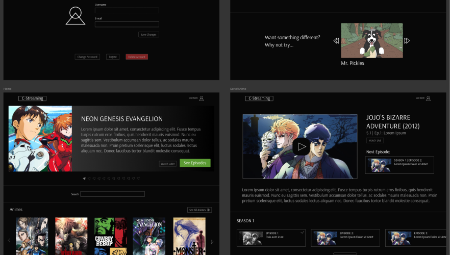

<h1 align="center">
    <a href="https://c-streaming.vercel.app/">
        C-Streaming
    </a>
</h1>

<div align="center" >
    
</div>

## 🤨 O que é isso?

**Definitivamente, não é um site de streaming, kk**

- Não é streaming, mas simula visualmente o comportamento de uma aplicação desse tipo em vários aspectos

- Essa é uma aplicação apenas frontend, sem consumo de API's http (a exceção, seria o GraphQL, porém, o  mesmo é usado apenas para obter imagens que estão nos assets)

- O objetivo disso é apenas aprendizado e aprimoramento

- O uso de libs externas foi evitado na maioria dos momentos

- Toda ideia, construção, e design foram totalmente autorais


## 👨🏼‍💻 Tecnologias/Ferramentas principais utilizadas

**Dev**
- Gatsby (Framework)
    - React
    - GraphQL
- TypeScript (linguagem)
- Styled-Components (CSS in TS)
- Zustand (global state manager)

**Testes de Acessibilidade**
- Narrador do Windows 10
- NVDA
- Talkback (observações sobre isso no final do README)

**Design**
- Figma

## 🤖 Funcionalidades da aplicação

- **Home**
    - O usuário pode ver e interagir com sugestões de obras (no geral, e por categoria)
    - O usuário pode pesquisar por alguma obra

- **Página de Filme**
    - O usuário pode assistir o filme
    - O usuário pode adicionar a obra na lista de assistir mais tarde
    - O usuário pode ver informações como:
        - Nome
        - Sinopse
    - No fim da pagina, são exibidas sugestões sobre qualquer outra obra que não seja a da página em questão, das quais o usuário pode interagir.

- **Página de Série/Anime**
    - O usuário pode assistir o episodio
    - O usuário pode adicionar a obra na lista de assistir mais tarde
    - O usuário pode ver informações como:
        - Nome da obra
        - Sinopse da obra
        - Nome do episódio
        - Número do episódio
        - Número da temporada
    - O usuário pode navegar entre as temporadas e episódios
    - O usuário pode ir diretamente para o próximo episodio
    - O usuário tem um feedback visual (e sonoro, no caso dos leitores de tela) dos episodios já assistidos sem precisar entrar nas suas respectivas páginas
    - **Regra:** Ao entrar na página, o episodio mostrado será o último assistido por ele (ou o 1º da obra, caso nunca tenha visto algum)

- **Histórico**
    - O histórico pode ser pesquisado
    - O histórico pode ser removido (items individuais, ou todos)
    - Para as series/animes, o histórico tem 2 funções extras:
        - Feedback visual dos episodios já vistos
        - Ao entrar na pagina de alguma obra, o episodio mostrado é o ultimo que o usuario estava assistindo
    - **Regra:** Assistir a alguma obra insere automaticamente no histórico

- **Assistir Mais Tarde**
    - Obras podem ser adicionadas ou removidas da lista
    - O usuario pode consultar essa lista

- **Pesquisa**
    - O usuário pode pesquisar as obras por:
        - Nome
        - Tipo (anime, filme, série)

- **Configurações de Usuário**
    - O usuario pode (aparentemente 🤫) ver e modificar:
        - Nome
        - Email
        - Senha

## 🚀 Rodando Localmente

A aplicação está hospedada na [Vercel](https://c-streaming.vercel.app/),
mas caso queira brincar/fazer modificações localmente, é só fazer o mesmo de sempre:
```shell
    git clone https://github.com/cicero-mello/c-streaming.git
```
```shell
    cd c-streaming
```
```shell
    npm i
```
```shell
    npm start
```
Por fim, basta acessar o [localhost:8000](http://localhost:8000/).

**Observação amigável:**

O nome dos episódios, lista de histórico e lista de assistir mais tarde são mantidos no localStorage (poderia ser o sessionStorage? sim, mas seria menos legal 🤷🏼‍♂️).

Então, se não quiser manter tais dados no seu navegador, basta usar uma aba anônima (ou excluir os dados manualmente quando lhe der vontade, hehe).


## 🤯 Considerações finais

Quando comecei a mergulhar na área de acessibilidade (focado no funcionamento de leitores de tela), vários pontos de discussão surgiram.

No fim, deixo um link pra uma página do Notion onde falo sobre esses e alguns outros pontos (não necessariamente relacionadas a acessibilidade).

Ex. de tópicos:

- Pq foi usado o Zustand?
- Pq alguns items não interativos podem ser focáveis?
- Comportamentos do Talkback
- ...

-> [**Notion**](https://vaulted-parade-385.notion.site/C-Streaming-11233bf3f417806cabb8eca309908c67?pvs=4) <-
